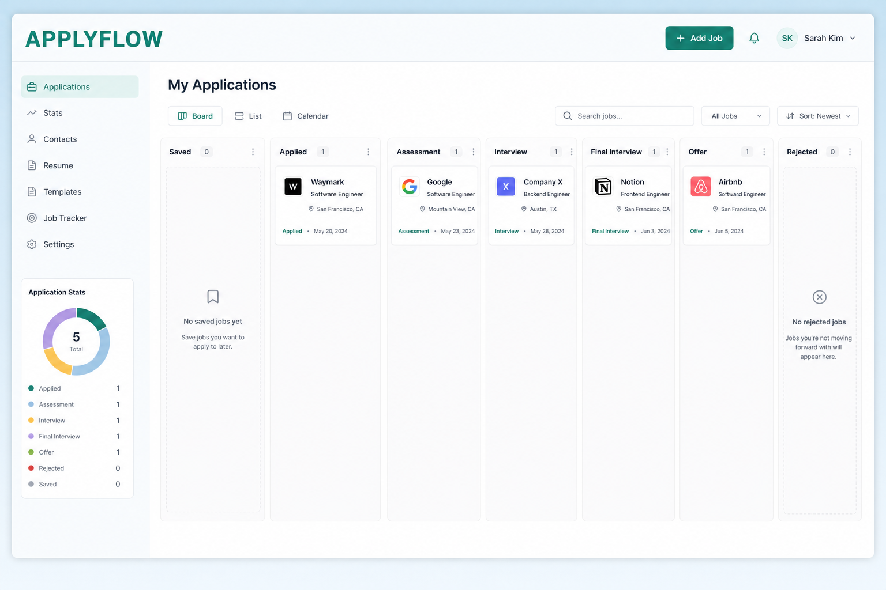
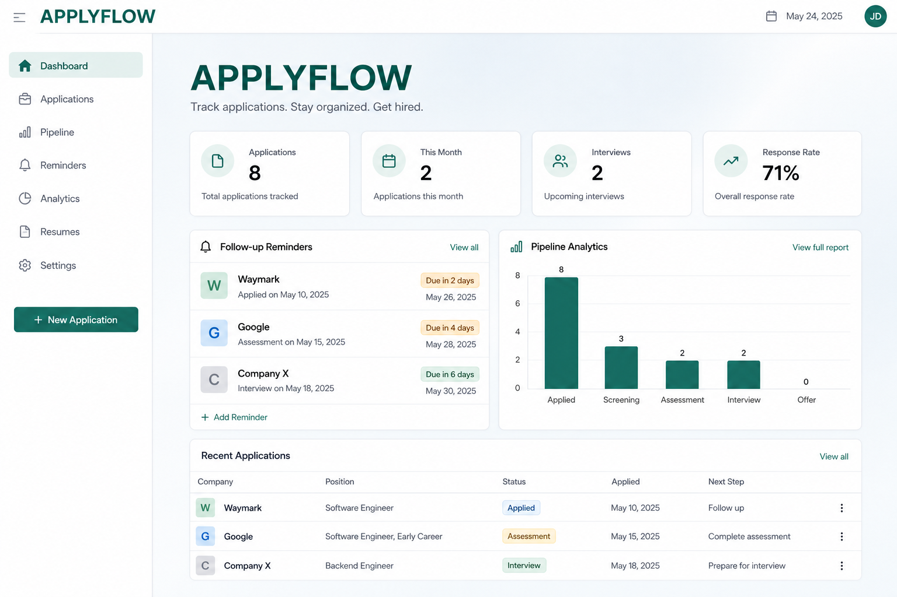
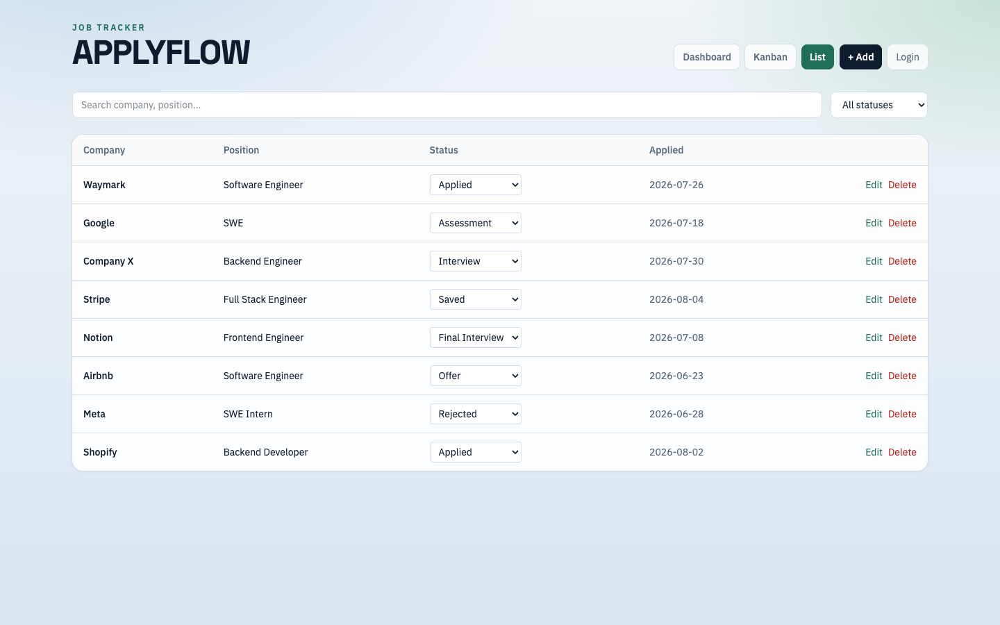

# ApplyFlow

Full-stack job application tracker built with React, TypeScript, FastAPI, and PostgreSQL.

**Live demo:** https://applyflow-m6ak.onrender.com

Demo / portfolio project — sample or fictional data only. Do not commit real application records, notes, recruiter contacts, or salary details. Local SQLite DBs (`.db`) and secrets (`.env`) are gitignored; never force-add them.

## Portfolio blurb (copy/paste)

> **ApplyFlow** — Full-stack job application tracker. Track company, role, status, and follow-ups on a Kanban board with search, dashboard analytics, and reminder digests. Built with React, TypeScript, Vite, Tailwind, FastAPI, SQLAlchemy, REST, SQLite/PostgreSQL. Deployed on Render.  
> Demo: https://applyflow-m6ak.onrender.com · Code: https://github.com/padmabaireddy/applyflow

**Resume one-liner:** Built ApplyFlow, a React/TypeScript + FastAPI job tracker with Kanban pipeline, analytics, and auth-protected writes (live on Render).


## Screenshots







## Features

- Add / edit / delete applications (login required; default password `demo`)
- Status pipeline + drag-and-drop Kanban
- Search & filter
- Dashboard stats, pipeline analytics, follow-up reminders
- Reminder digest + optional `REMINDER_WEBHOOK_URL` (Slack/email webhook)
- Seeded demo data on first launch
- PostgreSQL via `DATABASE_URL` (SQLite locally)

## Local run

```bash
# backend
cd backend
python3.13 -m venv venv
./venv/bin/pip install -i https://pypi.tuna.tsinghua.edu.cn/simple -r requirements.txt
./venv/bin/uvicorn app.main:app --reload --app-dir .

# frontend
cd frontend
npm install
npm run dev
```

API: http://127.0.0.1:8000  
App: http://127.0.0.1:5173

## Deploy (Render, no Docker)

Blueprint uses `render.yaml`. Set env vars in the Render dashboard:

| Var | Purpose |
|---|---|
| `DEMO_PASSWORD` | Login password (default `demo`) |
| `AUTH_SECRET` | JWT secret |
| `DATABASE_URL` | Optional Neon/Postgres URL |
| `REMINDER_WEBHOOK_URL` | Optional webhook for reminder digests |
| `CORS_ORIGINS` | `*` or your frontend origin |

**Postgres:** create a free Neon DB → paste connection string into `DATABASE_URL` → redeploy.

## Production build (no Docker)

```bash
cd frontend && npm ci && npm run build
mkdir -p ../backend/static && cp -r dist/* ../backend/static/
cd ../backend && ./venv/bin/uvicorn app.main:app --host 0.0.0.0 --port 8000
```
